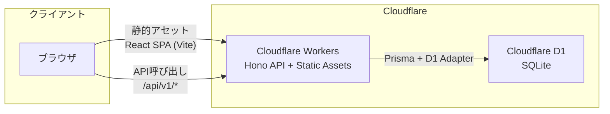

# アーキテクチャ設計書

## システム構成図



---

## ディレクトリ構成

```
ogiri/
├── api/                            # API サーバー（Cloudflare Workers）
│   ├── src/
│   │   ├── index.ts                # Hono アプリ エントリーポイント
│   │   ├── routes/
│   │   │   ├── auth.ts             # POST /auth/register, /auth/login, /auth/logout, GET /auth/me
│   │   │   ├── topics.ts           # GET/POST /topics, GET/DELETE /topics/:id
│   │   │   ├── answers.ts          # GET/POST /topics/:topicId/answers, GET/DELETE /answers/:id
│   │   │   ├── ratings.ts          # PUT/GET/DELETE /answers/:answerId/rating(s)
│   │   │   ├── comments.ts         # GET/POST /answers/:answerId/comments, DELETE .../comments/:id
│   │   │   └── users.ts            # GET /users/:id, /users/:id/topics, /users/:id/answers
│   │   ├── middleware/
│   │   │   ├── auth.ts             # JWT 検証ミドルウェア
│   │   │   ├── cors.ts             # CORS 設定
│   │   │   └── error-handler.ts    # グローバルエラーハンドラ
│   │   ├── services/               # ビジネスロジック層
│   │   │   ├── auth.service.ts
│   │   │   ├── topic.service.ts
│   │   │   ├── answer.service.ts
│   │   │   ├── rating.service.ts
│   │   │   ├── comment.service.ts
│   │   │   └── user.service.ts
│   │   ├── validators/             # Zod スキーマ定義
│   │   │   ├── auth.ts
│   │   │   ├── topic.ts
│   │   │   ├── answer.ts
│   │   │   ├── rating.ts
│   │   │   └── comment.ts
│   │   ├── lib/
│   │   │   ├── db.ts               # Prisma Client 初期化（D1 Adapter）
│   │   │   ├── auth.ts             # パスワードハッシュ / JWT 生成・検証
│   │   │   └── ulid.ts             # ULID 生成ユーティリティ
│   │   └── types/
│   │       └── env.d.ts            # Cloudflare Workers 環境変数型定義
│   ├── prisma/
│   │   ├── schema.prisma           # Prisma スキーマ
│   │   ├── migrations/             # マイグレーションファイル
│   │   └── seed.ts                 # 初回お題 seed スクリプト
│   ├── wrangler.toml               # Workers 設定
│   ├── tsconfig.json
│   ├── vitest.config.ts            # テスト設定
│   └── package.json
├── web/                            # React クライアント（Cloudflare Pages）
│   ├── src/
│   │   ├── main.tsx                # React エントリーポイント
│   │   ├── App.tsx                 # ルーティング定義
│   │   ├── pages/
│   │   │   ├── TopPage.tsx         # お題一覧
│   │   │   ├── TopicDetail.tsx     # お題詳細
│   │   │   ├── AnswerDetail.tsx    # 回答詳細
│   │   │   ├── UserProfile.tsx     # ユーザープロフィール
│   │   │   ├── Login.tsx           # ログイン
│   │   │   ├── Register.tsx        # 新規登録
│   │   │   └── NewTopic.tsx        # お題投稿
│   │   ├── components/
│   │   │   ├── layout/
│   │   │   │   └── Header.tsx
│   │   │   ├── topic/
│   │   │   │   └── TopicCard.tsx
│   │   │   ├── answer/
│   │   │   │   └── AnswerCard.tsx
│   │   │   ├── rating/
│   │   │   │   └── RatingInput.tsx
│   │   │   ├── comment/
│   │   │   │   └── CommentList.tsx
│   │   │   └── common/
│   │   │       ├── SortSelector.tsx
│   │   │       ├── Pagination.tsx
│   │   │       └── ConfirmDialog.tsx
│   │   ├── hooks/
│   │   │   ├── useAuth.ts          # 認証状態管理
│   │   │   └── useFetch.ts         # API 呼び出しフック
│   │   ├── api/
│   │   │   ├── client.ts           # fetch ラッパー（Base URL, Cookie, エラーハンドリング）
│   │   │   ├── auth.ts
│   │   │   ├── topics.ts
│   │   │   ├── answers.ts
│   │   │   ├── ratings.ts
│   │   │   ├── comments.ts
│   │   │   └── users.ts
│   │   ├── contexts/
│   │   │   └── AuthContext.tsx      # 認証コンテキスト
│   │   ├── types/
│   │   │   └── index.ts            # 共通型定義
│   │   └── styles/
│   │       └── index.scss          # グローバルスタイル + デザイントークン
│   ├── public/
│   ├── index.html
│   ├── vite.config.ts
│   ├── tsconfig.json
│   └── package.json
├── docs/                           # 設計ドキュメント
│   ├── er-diagram.md
│   ├── api-spec.md
│   ├── screens.md
│   ├── architecture.md
│   ├── tasks.md
│   └── images/
├── docker-compose.yml
├── Dockerfile.api
├── Dockerfile.web
├── .gitignore
├── CONCEPT.md
└── README.md
```

---

## 技術スタック詳細

### API サーバー

| カテゴリ | 技術 | バージョン方針 | 備考 |
|---|---|---|---|
| ランタイム | Cloudflare Workers | — | V8 ベース、Node.js API 一部互換 |
| フレームワーク | Hono | latest | Workers ネイティブ。ルーティング・ミドルウェア |
| ORM | Prisma | latest | `@prisma/adapter-d1` を使用 |
| バリデーション | Zod | latest | `@hono/zod-validator` で統合 |
| 認証 (JWT) | `hono/jwt` | Hono 同梱 | HMAC-SHA256。秘密鍵は Workers Secrets |
| パスワード | Web Crypto API | Workers 標準 | PBKDF2 + SHA-256。bcrypt は Workers で非対応な場合あり |
| ID 生成 | `ulid` | latest | — |
| テスト | Vitest | latest | `@cloudflare/vitest-pool-workers` で Workers 環境テスト |

### クライアント

| カテゴリ | 技術 | バージョン方針 | 備考 |
|---|---|---|---|
| UI | React | 19.x | — |
| スタイリング | CSS Modules (Sass) | latest | コンポーネント毎に `.module.scss` を作成 |
| ビルド | Vite | latest | — |
| ルーティング | React Router | v7 | — |
| HTTP | fetch (自作ラッパー) | — | 外部ライブラリ不要 |
| フォント | Google Fonts (Noto Sans JP) | — | `<link>` で読み込み |

---

## 認証フロー

```mermaid
sequenceDiagram
    actor User
    participant Client as React Client
    participant API as Hono API
    participant DB as D1

    User->>Client: ログインフォーム入力
    Client->>API: POST /api/v1/auth/login
    API->>DB: SELECT user WHERE username
    DB-->>API: User record
    API->>API: パスワード検証 (PBKDF2)
    API->>API: JWT 生成 (HS256)
    API-->>Client: 200 OK + Set-Cookie (token=JWT; HttpOnly; Secure; SameSite=Strict)
    Client->>Client: AuthContext 更新

    Note over Client,API: 以降の認証付きリクエスト
    Client->>API: POST /api/v1/topics (Cookie: token=JWT)
    API->>API: JWT 検証ミドルウェア
    API->>DB: INSERT topic
    DB-->>API: Created
    API-->>Client: 201 Created
```

### JWT ペイロード

```json
{
  "sub": "01H5K5...",
  "username": "sasaki",
  "exp": 1691884800,
  "iat": 1691798400
}
```

- `sub`: ユーザーID（ULID）
- 有効期限: 24時間（要件に応じて調整）
- 署名アルゴリズム: HS256
- 秘密鍵: Workers Secrets (`JWT_SECRET`)

---

## CORS 設定

```typescript
// 開発環境
{
  origin: 'http://localhost:5173',
  credentials: true
}

// 本番環境
{
  origin: 'https://ogiri.pages.dev',  // Cloudflare Pages のドメイン
  credentials: true
}
```

- `credentials: true` により Cookie の送受信を許可
- `origin` は環境変数で切替

---

## Docker Compose（開発環境）

```yaml
# docker-compose.yml の設計
services:
  api:
    build:
      context: .
      dockerfile: Dockerfile.api
    ports:
      - "8787:8787"
    volumes:
      - ./api:/app
      - /app/node_modules
    command: npx wrangler dev --local --port 8787
    environment:
      - JWT_SECRET=dev-secret-key

  web:
    build:
      context: .
      dockerfile: Dockerfile.web
    ports:
      - "5173:5173"
    volumes:
      - ./web:/app
      - /app/node_modules
    command: npm run dev -- --host 0.0.0.0
    environment:
      - VITE_API_BASE_URL=http://localhost:8787/api/v1
    depends_on:
      - api
```

### Dockerfile 方針

- **Dockerfile.api**: `node:20-slim` ベース。wrangler CLI をインストール
- **Dockerfile.web**: `node:20-slim` ベース。Vite dev server 起動

---

## デプロイ構成

### 統合デプロイ（Workers Static Assets）

API と Web フロントエンドを1つの Cloudflare Worker として統合デプロイする。
Workers Static Assets を利用し、静的アセット（React SPA）と API を同一オリジンから配信する。

```toml
# wrangler.toml
name = "ogiri-api"
main = "src/index.ts"
compatibility_date = "2026-08-01"
compatibility_flags = ["nodejs_compat"]

[assets]
directory = "../web/dist"
not_found_handling = "single-page-application"

[[d1_databases]]
binding = "DB"
database_name = "ogiri-db"
database_id = "<D1_DATABASE_ID>"

# JWT_SECRET は `wrangler secret put JWT_SECRET` で設定
```

- 静的アセットへのリクエストは Worker コードを経由せず直接配信（無料・高速）
- SPA のクライアントサイドルーティングは `not_found_handling = "single-page-application"` で対応
- API リクエスト（`/api/v1/*`）のみ Hono が処理
- 同一オリジンのため CORS 設定は本番環境では不要

### 自動デプロイ（Workers Builds）

Cloudflare ダッシュボードから GitHub リポジトリを接続し、Workers Builds を利用する。

- ルートディレクトリ: `/api`
- ビルドコマンド: `npm run build:all`（Web ビルド + Prisma Client 生成）
- デプロイコマンド: `npx wrangler deploy`

### Seed データ投入

デプロイ後、初回お題を投入する。

```bash
# D1 に直接 SQL を実行
wrangler d1 execute ogiri-db --command "INSERT INTO Topic (id, body, user_id, created_at, updated_at) VALUES ('seed_topic_001', '最初のお題：こんな大喜利サイトは嫌だ。どんなの？', 'system_user_001', datetime('now'), datetime('now'))"
```

> [!NOTE]
> Seed スクリプト (`api/prisma/seed.ts`) を用意し、`wrangler d1 execute` で実行する方式とする。
> システムユーザー（`system_user_001`）も seed で作成する。

---

## エラーハンドリング方針

### API 側

```typescript
// グローバルエラーハンドラ
app.onError((err, c) => {
  if (err instanceof AppError) {
    return c.json({ error: { code: err.code, message: err.message } }, err.status);
  }
  console.error(err);
  return c.json({ error: { code: 'INTERNAL_ERROR', message: 'サーバーエラーが発生しました' } }, 500);
});
```

- カスタムエラークラス `AppError` を定義し、ビジネスロジック層から throw
- バリデーションエラーは `@hono/zod-validator` が自動で 400 を返す

### クライアント側

- API クライアントの fetch ラッパーでレスポンスのステータスコードを検査
- 401 の場合は AuthContext をクリアしログイン画面へリダイレクト
- エラーメッセージはトースト通知で表示
