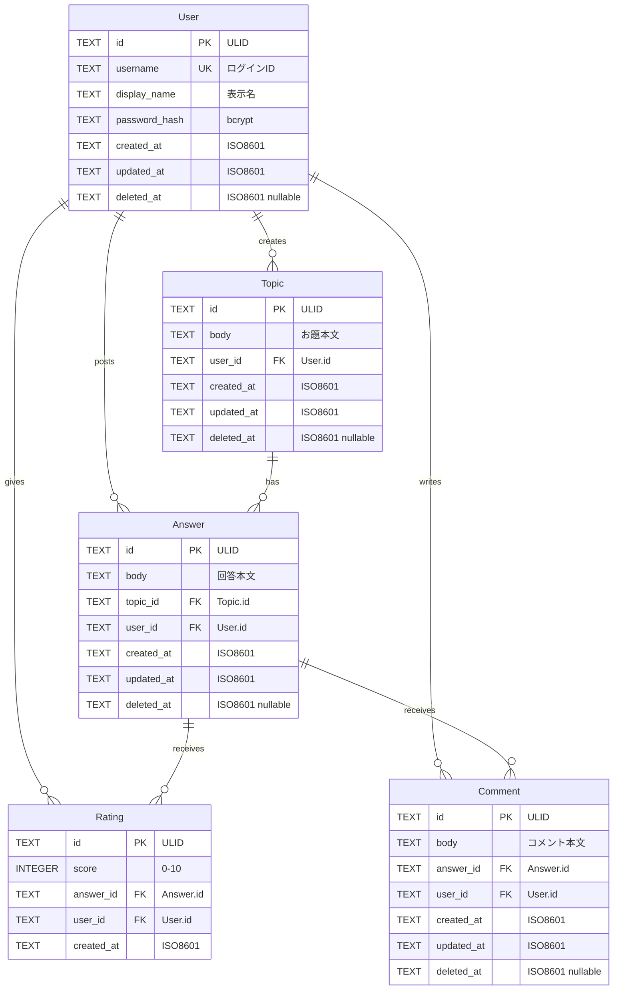

# ER図 + テーブル定義

## ER図

---

## テーブル定義詳細

### User

ユーザーアカウント情報。認証の主体。

| カラム | 型 | 制約 | 説明 |
|---|---|---|---|
| `id` | TEXT | PK | ULID（26文字） |
| `username` | TEXT | UNIQUE, NOT NULL | ログインに使用する一意な識別子。英数字+アンダースコア、3〜32文字 |
| `display_name` | TEXT | NOT NULL | 画面表示用の名前。1〜50文字 |
| `password_hash` | TEXT | NOT NULL | bcrypt でハッシュ化されたパスワード |
| `created_at` | TEXT | NOT NULL | 作成日時（ISO8601） |
| `updated_at` | TEXT | NOT NULL | 更新日時（ISO8601） |
| `deleted_at` | TEXT | NULL | 論理削除日時。NULL = 有効 |

**インデックス:**
- `idx_user_username` ON `username` — ログイン時の検索用

---

### Topic

お題。ユーザーが自由に投稿する。

| カラム | 型 | 制約 | 説明 |
|---|---|---|---|
| `id` | TEXT | PK | ULID |
| `body` | TEXT | NOT NULL | お題本文。1〜500文字 |
| `user_id` | TEXT | FK → User.id, NOT NULL | 投稿者 |
| `created_at` | TEXT | NOT NULL | 作成日時 |
| `updated_at` | TEXT | NOT NULL | 更新日時 |
| `deleted_at` | TEXT | NULL | 論理削除日時 |

**インデックス:**
- `idx_topic_user_id` ON `user_id` — ユーザー別一覧取得用
- `idx_topic_created_at` ON `created_at` — 新着順ソート用

---

### Answer

お題に対する回答。

| カラム | 型 | 制約 | 説明 |
|---|---|---|---|
| `id` | TEXT | PK | ULID |
| `body` | TEXT | NOT NULL | 回答本文。1〜500文字 |
| `topic_id` | TEXT | FK → Topic.id, NOT NULL | 対象のお題 |
| `user_id` | TEXT | FK → User.id, NOT NULL | 回答者 |
| `created_at` | TEXT | NOT NULL | 作成日時 |
| `updated_at` | TEXT | NOT NULL | 更新日時 |
| `deleted_at` | TEXT | NULL | 論理削除日時 |

**インデックス:**
- `idx_answer_topic_id` ON `topic_id` — お題別回答一覧取得用
- `idx_answer_user_id` ON `user_id` — ユーザー別回答一覧取得用

---

### Rating

回答に対する評価。1人1回答につき1回のみ。

| カラム | 型 | 制約 | 説明 |
|---|---|---|---|
| `id` | TEXT | PK | ULID |
| `score` | INTEGER | NOT NULL, CHECK(0 <= score <= 10) | 評価スコア（0〜10の整数） |
| `answer_id` | TEXT | FK → Answer.id, NOT NULL | 評価対象の回答 |
| `user_id` | TEXT | FK → User.id, NOT NULL | 評価者 |
| `created_at` | TEXT | NOT NULL | 評価日時 |

**制約:**
- `uq_rating_answer_user` UNIQUE ON `(answer_id, user_id)` — 1人1回答1評価を保証

**インデックス:**
- `idx_rating_answer_id` ON `answer_id` — 回答別評価一覧取得用

> [!NOTE]
> Rating には `deleted_at` を設けない。評価の取り消しは DELETE（物理削除）で対応する。
> これにより再評価（PUT による UPSERT）が可能になる。

---

### Comment

回答に対するコメント。

| カラム | 型 | 制約 | 説明 |
|---|---|---|---|
| `id` | TEXT | PK | ULID |
| `body` | TEXT | NOT NULL | コメント本文。1〜500文字 |
| `answer_id` | TEXT | FK → Answer.id, NOT NULL | 対象の回答 |
| `user_id` | TEXT | FK → User.id, NOT NULL | コメント投稿者 |
| `created_at` | TEXT | NOT NULL | 作成日時 |
| `updated_at` | TEXT | NOT NULL | 更新日時 |
| `deleted_at` | TEXT | NULL | 論理削除日時 |

**インデックス:**
- `idx_comment_answer_id` ON `answer_id` — 回答別コメント一覧取得用

---

## 論理削除の方針

| 対象 | 削除可能者 | 方式 | 他ユーザーからの表示 |
|---|---|---|---|
| User | 本人 | `deleted_at` に日時をセット | 参照不可（一覧・詳細から除外） |
| Topic | 投稿者本人 | `deleted_at` に日時をセット | 参照不可 |
| Answer | 投稿者本人 | `deleted_at` に日時をセット | 参照不可 |
| Comment | 投稿者本人 | `deleted_at` に日時をセット | 参照不可 |
| Rating | 評価者本人 | 物理削除（DELETE） | — |

- 全ての一覧・詳細取得クエリに `WHERE deleted_at IS NULL` を付与する
- 削除されたお題に紐づく回答・評価・コメントは残存するが、お題経由でのアクセスが不可能になるため、実質的に参照不可
- 削除されたユーザーの投稿は、表示名を「削除済みユーザー」に置換して表示する方式も検討可能だが、初回リリースでは単純に除外する

---

## データ型の補足（D1 / SQLite 制約）

D1 は SQLite ベースのため、以下の制約を考慮する。

| 項目 | 対応方針 |
|---|---|
| 日時型 | SQLite に DATETIME 型はないため TEXT (ISO8601) で保管。Prisma は `@default(now())` で対応 |
| BOOLEAN 型 | SQLite では INTEGER (0/1)。今回は使用しない |
| 主キー | TEXT (ULID)。AUTO INCREMENT は使わない |
| CHECK 制約 | D1 は CHECK 制約をサポート。`score` の範囲制約に使用 |
| 外部キー | D1 はデフォルトで FK 無効。`PRAGMA foreign_keys = ON` を接続時に実行するか、Prisma レベルで整合性を担保 |
