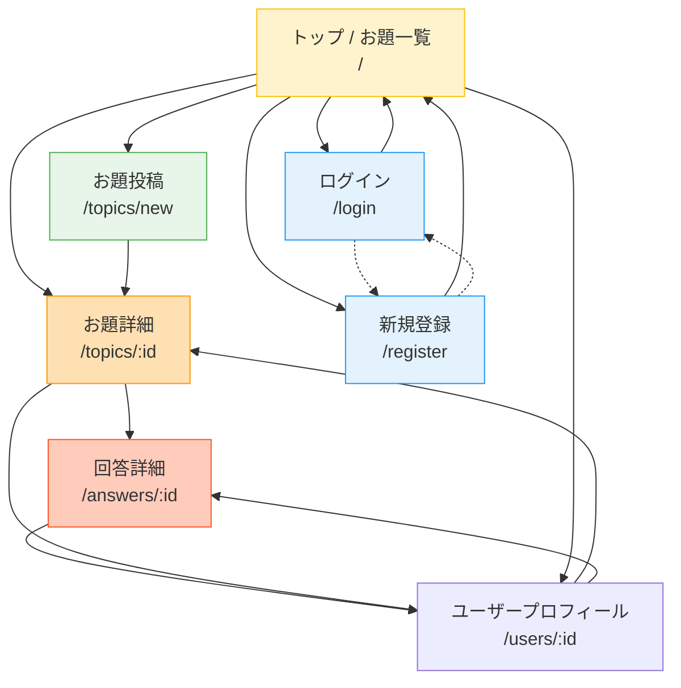
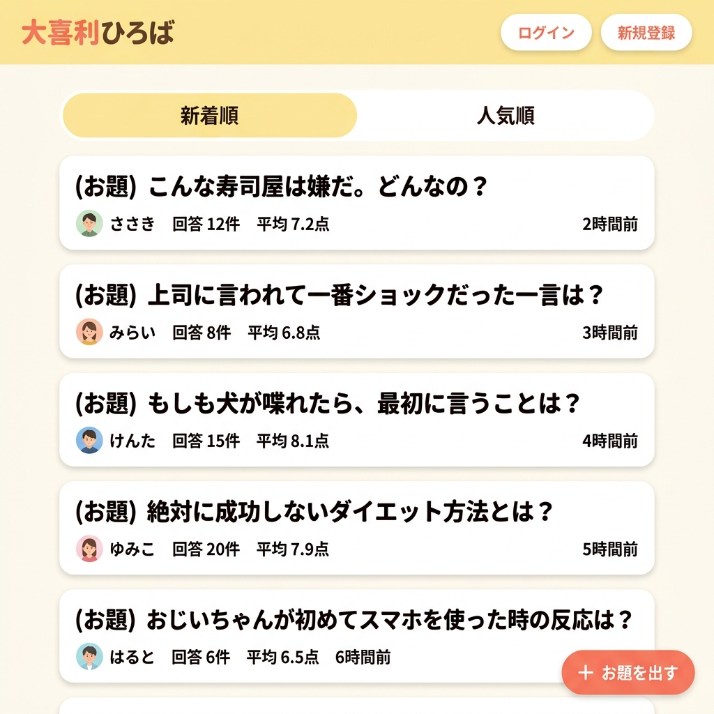
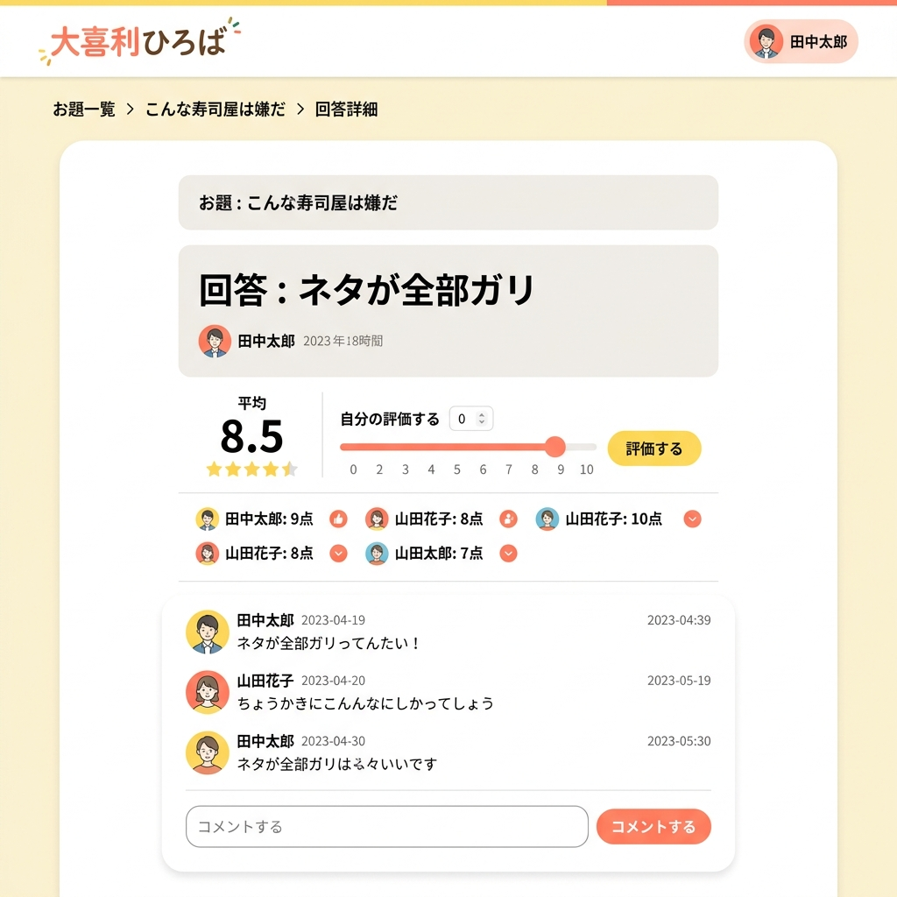

# 画面設計書

## 画面一覧

| # | 画面名 | パス | 認証 | 説明 |
|---|---|---|---|---|
| 1 | トップ / お題一覧 | `/` | 不要 | お題の新着・人気一覧 |
| 2 | お題詳細 | `/topics/:id` | 不要（回答投稿時は必要） | お題 + 回答一覧 + 回答投稿 |
| 3 | 回答詳細 | `/answers/:id` | 不要（評価・コメント時は必要） | 回答 + 評価 + コメント |
| 4 | ユーザープロフィール | `/users/:id` | 不要 | ユーザー情報 + 投稿一覧 |
| 5 | ログイン | `/login` | 不要 | ログインフォーム |
| 6 | 新規登録 | `/register` | 不要 | 新規登録フォーム |
| 7 | お題投稿 | `/topics/new` | 必要 | お題投稿フォーム |

---

## 画面遷移図

---

## 各画面詳細

### 1. トップ / お題一覧（`/`）

#### 構成要素

| 要素 | 説明 |
|---|---|
| ヘッダー | ロゴ「大喜利ひろば」、ログイン/新規登録ボタン（未認証時）、ユーザー名+アバター（認証時） |
| ソートタブ | 「新着順」「人気順」切替 |
| お題カードリスト | 各カードにお題本文・投稿者名・回答数・平均スコア・投稿日時 |
| FAB | 「＋ お題を出す」ボタン（認証時のみ表示） |
| ページネーション | ページ番号ナビゲーション |

#### 操作

| 操作 | 遷移先 / アクション |
|---|---|
| お題カードをクリック | お題詳細画面へ遷移 |
| ソートタブ切替 | 一覧を再取得して表示 |
| FAB クリック | お題投稿画面へ遷移（未認証ならログインへ） |
| 投稿者名をクリック | ユーザープロフィールへ遷移 |

---

### 2. お題詳細（`/topics/:id`）

#### 構成要素

| 要素 | 説明 |
|---|---|
| お題カード | お題本文を目立つカードで表示。投稿者名・投稿日時 |
| ソートタブ | 回答の「新着順」「高評価順」切替 |
| 回答カードリスト | 各カードに回答本文・回答者名・平均スコア・コメント数 |
| 回答投稿フォーム | テキスト入力 + 投稿ボタン（認証時のみ） |
| 削除ボタン | お題投稿者本人にのみ表示。確認ダイアログ付き |

#### 操作

| 操作 | 遷移先 / アクション |
|---|---|
| 回答カードをクリック | 回答詳細画面へ遷移 |
| 回答投稿ボタン | API呼び出し → 回答一覧に新規回答を追加表示 |
| 投稿者名をクリック | ユーザープロフィールへ遷移 |
| 削除ボタン | 確認ダイアログ → API呼び出し → トップへ遷移 |

---

### 3. 回答詳細（`/answers/:id`）

#### 構成要素

| 要素 | 説明 |
|---|---|
| パンくずリスト | 「お題一覧 > お題本文 > 回答詳細」 |
| 元のお題 | 小さなカードで表示。クリックでお題詳細へ |
| 回答カード | 回答本文・回答者名・投稿日時 |
| 評価セクション | 平均スコア表示 + スライダー（0-10）+ 「評価する」ボタン |
| 評価者一覧 | 各評価者の名前とスコアをリスト表示 |
| コメントセクション | コメント一覧 + コメント投稿フォーム |
| 削除ボタン | 回答投稿者本人にのみ表示 |

#### 操作

| 操作 | 遷移先 / アクション |
|---|---|
| スライダーで評価 + 評価ボタン | PUT API → 評価一覧を更新表示 |
| コメント投稿 | POST API → コメント一覧に追加 |
| 評価者名をクリック | ユーザープロフィールへ遷移 |
| 元のお題をクリック | お題詳細画面へ遷移 |
| 削除ボタン | 確認ダイアログ → API呼び出し → お題詳細へ遷移 |

---

### 4. ユーザープロフィール（`/users/:id`）

#### 構成要素

| 要素 | 説明 |
|---|---|
| ユーザー情報 | 表示名・ユーザー名・登録日 |
| タブ切替 | 「お題」「回答」 |
| 投稿一覧 | 選択タブに応じて、お題一覧 or 回答一覧を表示 |

---

### 5. ログイン（`/login`）

#### 構成要素

| 要素 | 説明 |
|---|---|
| フォーム | ユーザー名 + パスワード入力 |
| ログインボタン | 認証API呼び出し |
| 新規登録リンク | 新規登録画面への遷移 |
| エラー表示 | 認証失敗時のメッセージ |

---

### 6. 新規登録（`/register`）

#### 構成要素

| 要素 | 説明 |
|---|---|
| フォーム | ユーザー名 + 表示名 + パスワード + パスワード確認 |
| 登録ボタン | 登録API呼び出し → 自動ログイン → トップへ遷移 |
| ログインリンク | ログイン画面への遷移 |
| バリデーションエラー | 各フィールドのエラー表示 |

---

### 7. お題投稿（`/topics/new`）

#### 構成要素

| 要素 | 説明 |
|---|---|
| フォーム | お題本文（テキストエリア、500文字制限表示） |
| 投稿ボタン | POST API → お題詳細画面へ遷移 |
| 文字数カウンター | 残り文字数をリアルタイム表示 |

---

## 共通コンポーネント

| コンポーネント | 使用箇所 | 説明 |
|---|---|---|
| `Header` | 全画面 | ロゴ + 認証状態に応じたナビゲーション |
| `TopicCard` | お題一覧、ユーザープロフィール | お題のカード表示 |
| `AnswerCard` | お題詳細、ユーザープロフィール | 回答のカード表示 |
| `RatingInput` | 回答詳細 | スライダー + 評価ボタン |
| `CommentList` | 回答詳細 | コメント一覧 + 投稿フォーム |
| `SortSelector` | お題一覧、お題詳細 | ソートタブ切替 |
| `Pagination` | 一覧表示画面 | ページネーション |
| `ConfirmDialog` | 削除操作時 | 確認モーダル |

---

## デザイントークン

| トークン | 値 | 用途 |
|---|---|---|
| Primary | `#FFC107` (Amber) | ロゴ、ヘッダー背景、強調 |
| Secondary | `#FF5722` (Deep Orange) | ボタン、FAB |
| Background | `#FFF8E1` (Light Amber) | 全体背景 |
| Surface | `#FFFFFF` | カード背景 |
| Text Primary | `#212121` | 本文 |
| Text Secondary | `#757575` | 補足テキスト |
| Border Radius | `12px` | カード、ボタン |
| Font | Noto Sans JP | 全体 |
