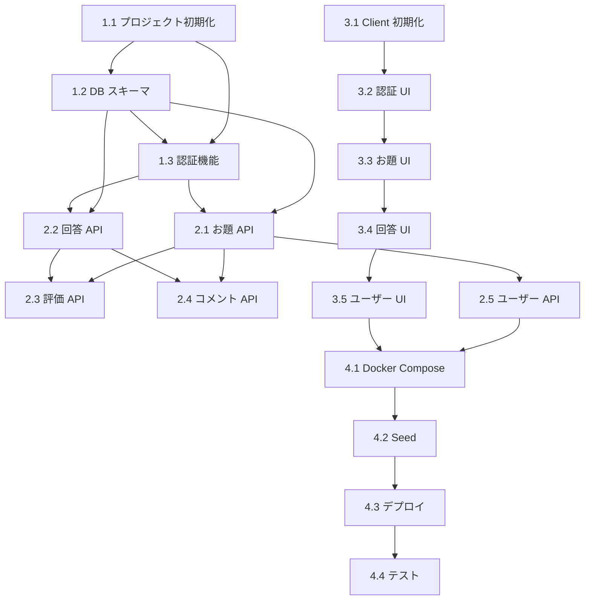

# 実装タスク一覧

## フェーズ構成

```mermaid
gantt
    title 実装フェーズ
    dateFormat X
    axisFormat %s

    section Phase 1: 基盤
    プロジェクト初期化           :p1_1, 0, 1
    DB スキーマ + マイグレーション :p1_2, 1, 2
    認証機能                     :p1_3, 2, 4

    section Phase 2: コア機能（API）
    お題 CRUD                    :p2_1, 4, 6
    回答 CRUD                    :p2_2, 4, 6
    評価機能                     :p2_3, 6, 7
    コメント機能                 :p2_4, 6, 7
    ユーザー参照                 :p2_5, 6, 7

    section Phase 3: クライアント
    プロジェクト初期化 + ルーティング :p3_1, 7, 8
    認証 UI                      :p3_2, 8, 9
    お題一覧 + 詳細               :p3_3, 9, 11
    回答詳細 + 評価 + コメント    :p3_4, 11, 13
    ユーザープロフィール          :p3_5, 13, 14

    section Phase 4: 仕上げ
    Docker Compose               :p4_1, 14, 15
    Seed データ                  :p4_2, 15, 16
    デプロイ設定                 :p4_3, 16, 17
    E2E テスト + 修正            :p4_4, 17, 19
```



---

## Phase 1: 基盤構築

### 1.1 プロジェクト初期化

| # | タスク | 成果物 |
|---|---|---|
| 1.1.1 | `api/` ディレクトリ作成、`npm init`、依存関係インストール | `api/package.json` |
| 1.1.2 | TypeScript 設定 | `api/tsconfig.json` |
| 1.1.3 | Wrangler 設定 | `api/wrangler.toml` |
| 1.1.4 | Hono アプリのエントリーポイント作成 | `api/src/index.ts` |
| 1.1.5 | `.gitignore` 作成 | `.gitignore` |

**依存関係:**
```
hono
@hono/zod-validator
@prisma/client
@prisma/adapter-d1
prisma (devDependency)
zod
ulid
wrangler (devDependency)
vitest (devDependency)
@cloudflare/vitest-pool-workers (devDependency)
```

### 1.2 DB スキーマ + マイグレーション

| # | タスク | 成果物 |
|---|---|---|
| 1.2.1 | Prisma スキーマ定義 | `api/prisma/schema.prisma` |
| 1.2.2 | D1 アダプター設定 + Prisma Client 初期化ユーティリティ | `api/src/lib/db.ts` |
| 1.2.3 | マイグレーション生成 + 実行 | `api/prisma/migrations/` |
| 1.2.4 | ULID 生成ユーティリティ | `api/src/lib/ulid.ts` |

### 1.3 認証機能

| # | タスク | 成果物 |
|---|---|---|
| 1.3.1 | パスワードハッシュ（PBKDF2）ユーティリティ | `api/src/lib/auth.ts` |
| 1.3.2 | JWT 生成・検証ユーティリティ | `api/src/lib/auth.ts` |
| 1.3.3 | 認証ミドルウェア（JWT Cookie 検証） | `api/src/middleware/auth.ts` |
| 1.3.4 | CORS ミドルウェア | `api/src/middleware/cors.ts` |
| 1.3.5 | エラーハンドラミドルウェア | `api/src/middleware/error-handler.ts` |
| 1.3.6 | 認証バリデーター（Zod） | `api/src/validators/auth.ts` |
| 1.3.7 | 認証サービス（register / login / logout / me） | `api/src/services/auth.service.ts` |
| 1.3.8 | 認証ルート | `api/src/routes/auth.ts` |
| 1.3.9 | 認証 API テスト | `api/src/__tests__/auth.test.ts` |

---

## Phase 2: コア機能（API）

### 2.1 お題（Topics）

| # | タスク | 成果物 |
|---|---|---|
| 2.1.1 | お題バリデーター | `api/src/validators/topic.ts` |
| 2.1.2 | お題サービス（一覧・詳細・作成・削除） | `api/src/services/topic.service.ts` |
| 2.1.3 | お題ルート | `api/src/routes/topics.ts` |
| 2.1.4 | お題 API テスト | `api/src/__tests__/topics.test.ts` |

### 2.2 回答（Answers）

| # | タスク | 成果物 |
|---|---|---|
| 2.2.1 | 回答バリデーター | `api/src/validators/answer.ts` |
| 2.2.2 | 回答サービス | `api/src/services/answer.service.ts` |
| 2.2.3 | 回答ルート | `api/src/routes/answers.ts` |
| 2.2.4 | 回答 API テスト | `api/src/__tests__/answers.test.ts` |

### 2.3 評価（Ratings）

| # | タスク | 成果物 |
|---|---|---|
| 2.3.1 | 評価バリデーター | `api/src/validators/rating.ts` |
| 2.3.2 | 評価サービス（UPSERT / 一覧 / 削除） | `api/src/services/rating.service.ts` |
| 2.3.3 | 評価ルート | `api/src/routes/ratings.ts` |
| 2.3.4 | 評価 API テスト | `api/src/__tests__/ratings.test.ts` |

### 2.4 コメント（Comments）

| # | タスク | 成果物 |
|---|---|---|
| 2.4.1 | コメントバリデーター | `api/src/validators/comment.ts` |
| 2.4.2 | コメントサービス | `api/src/services/comment.service.ts` |
| 2.4.3 | コメントルート | `api/src/routes/comments.ts` |
| 2.4.4 | コメント API テスト | `api/src/__tests__/comments.test.ts` |

### 2.5 ユーザー（Users）

| # | タスク | 成果物 |
|---|---|---|
| 2.5.1 | ユーザーサービス（プロフィール / お題一覧 / 回答一覧） | `api/src/services/user.service.ts` |
| 2.5.2 | ユーザールート | `api/src/routes/users.ts` |
| 2.5.3 | ユーザー API テスト | `api/src/__tests__/users.test.ts` |

---

## Phase 3: クライアント

### 3.1 プロジェクト初期化

| # | タスク | 成果物 |
|---|---|---|
| 3.1.1 | Vite + React プロジェクト作成 | `web/` |
| 3.1.2 | React Router 設定 | `web/src/App.tsx` |
| 3.1.3 | グローバルスタイル + デザイントークン定義 | `web/src/styles/index.css` |
| 3.1.4 | API クライアント（fetch ラッパー） | `web/src/api/client.ts` |
| 3.1.5 | 型定義 | `web/src/types/index.ts` |
| 3.1.6 | Google Fonts (Noto Sans JP) 導入 | `web/index.html` |

### 3.2 認証 UI

| # | タスク | 成果物 |
|---|---|---|
| 3.2.1 | AuthContext + useAuth フック | `web/src/contexts/AuthContext.tsx`, `web/src/hooks/useAuth.ts` |
| 3.2.2 | API クライアント（認証系） | `web/src/api/auth.ts` |
| 3.2.3 | Header コンポーネント | `web/src/components/layout/Header.tsx` |
| 3.2.4 | ログインページ | `web/src/pages/Login.tsx` |
| 3.2.5 | 新規登録ページ | `web/src/pages/Register.tsx` |

### 3.3 お題一覧 + 詳細

| # | タスク | 成果物 |
|---|---|---|
| 3.3.1 | API クライアント（お題系） | `web/src/api/topics.ts` |
| 3.3.2 | SortSelector コンポーネント | `web/src/components/common/SortSelector.tsx` |
| 3.3.3 | Pagination コンポーネント | `web/src/components/common/Pagination.tsx` |
| 3.3.4 | TopicCard コンポーネント | `web/src/components/topic/TopicCard.tsx` |
| 3.3.5 | トップページ（お題一覧） | `web/src/pages/TopPage.tsx` |
| 3.3.6 | AnswerCard コンポーネント | `web/src/components/answer/AnswerCard.tsx` |
| 3.3.7 | お題詳細ページ | `web/src/pages/TopicDetail.tsx` |
| 3.3.8 | お題投稿ページ | `web/src/pages/NewTopic.tsx` |
| 3.3.9 | ConfirmDialog コンポーネント | `web/src/components/common/ConfirmDialog.tsx` |

### 3.4 回答詳細 + 評価 + コメント

| # | タスク | 成果物 |
|---|---|---|
| 3.4.1 | API クライアント（回答・評価・コメント系） | `web/src/api/answers.ts`, `ratings.ts`, `comments.ts` |
| 3.4.2 | RatingInput コンポーネント | `web/src/components/rating/RatingInput.tsx` |
| 3.4.3 | CommentList コンポーネント | `web/src/components/comment/CommentList.tsx` |
| 3.4.4 | 回答詳細ページ | `web/src/pages/AnswerDetail.tsx` |

### 3.5 ユーザープロフィール

| # | タスク | 成果物 |
|---|---|---|
| 3.5.1 | API クライアント（ユーザー系） | `web/src/api/users.ts` |
| 3.5.2 | ユーザープロフィールページ | `web/src/pages/UserProfile.tsx` |

---

## Phase 4: 仕上げ

### 4.1 Docker Compose

| # | タスク | 成果物 |
|---|---|---|
| 4.1.1 | API 用 Dockerfile | `Dockerfile.api` |
| 4.1.2 | Web 用 Dockerfile | `Dockerfile.web` |
| 4.1.3 | docker-compose.yml | `docker-compose.yml` |
| 4.1.4 | 動作確認 | — |

### 4.2 Seed データ

| # | タスク | 成果物 |
|---|---|---|
| 4.2.1 | システムユーザー + 初回お題の seed スクリプト | `api/prisma/seed.ts` |
| 4.2.2 | seed 実行手順をREADMEに記載 | `README.md` |

### 4.3 デプロイ設定

| # | タスク | 成果物 |
|---|---|---|
| 4.3.1 | Cloudflare D1 データベース作成 | — |
| 4.3.2 | Workers デプロイ設定 + Secrets 設定 | `api/wrangler.toml` |
| 4.3.3 | Pages デプロイ設定 | — |
| 4.3.4 | 本番マイグレーション + seed 実行 | — |
| 4.3.5 | デプロイ手順を README に記載 | `README.md` |

### 4.4 テスト + 修正

| # | タスク | 成果物 |
|---|---|---|
| 4.4.1 | 全 API エンドポイントの統合テスト | テストファイル群 |
| 4.4.2 | クライアントの画面遷移テスト（手動） | — |
| 4.4.3 | バグ修正 | — |
| 4.4.4 | README 最終更新 | `README.md` |

---

## 依存関係マトリクス


